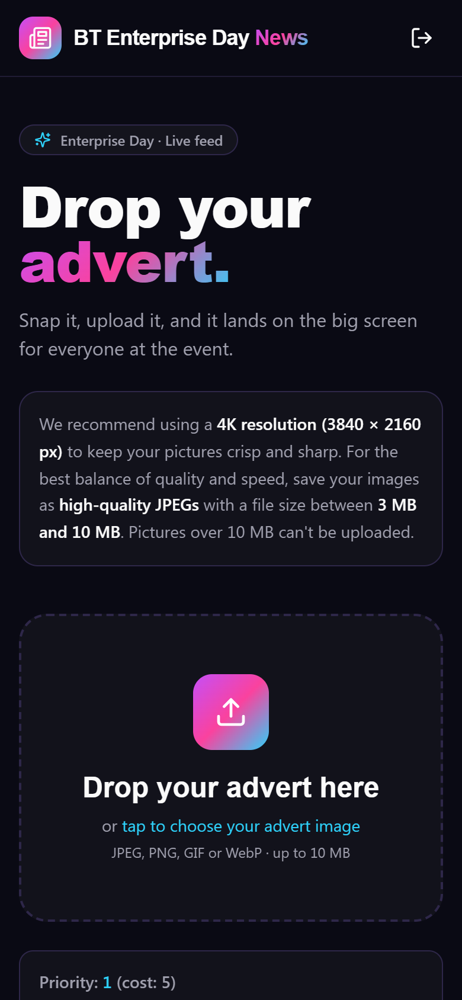
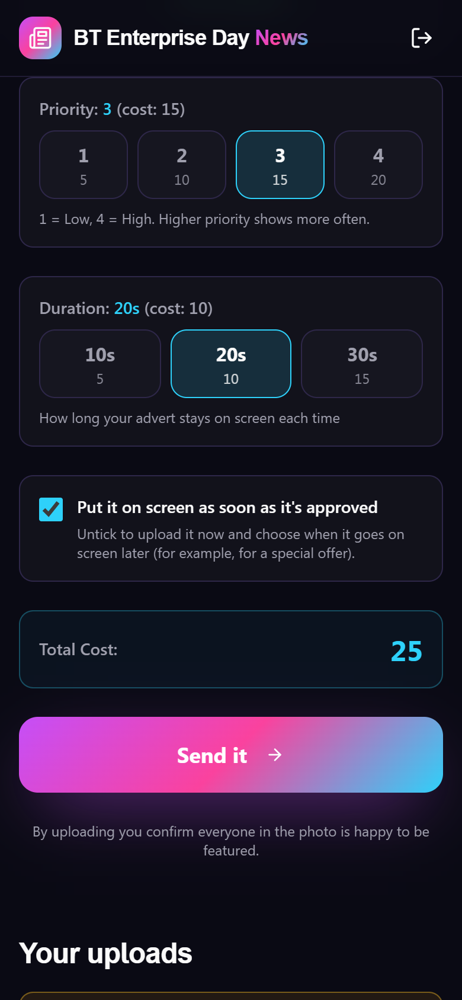
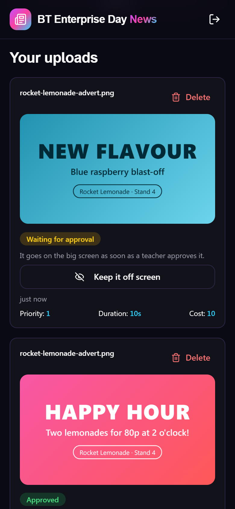
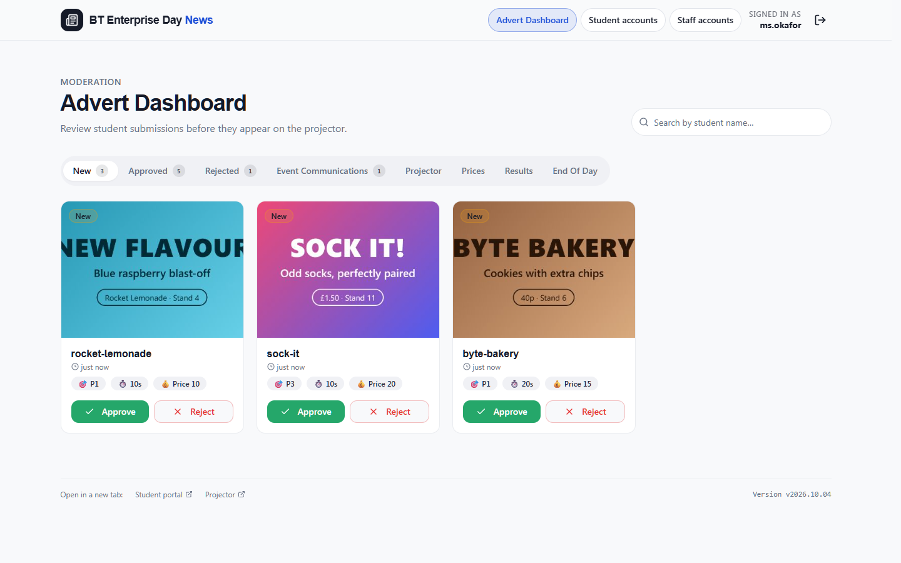
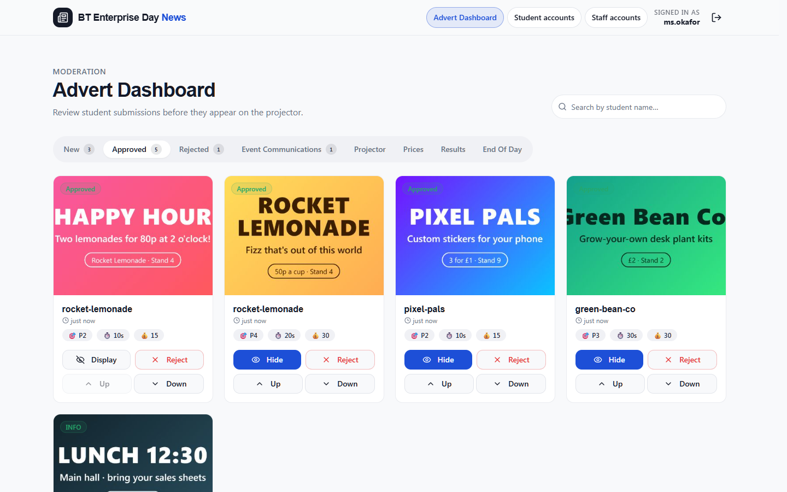
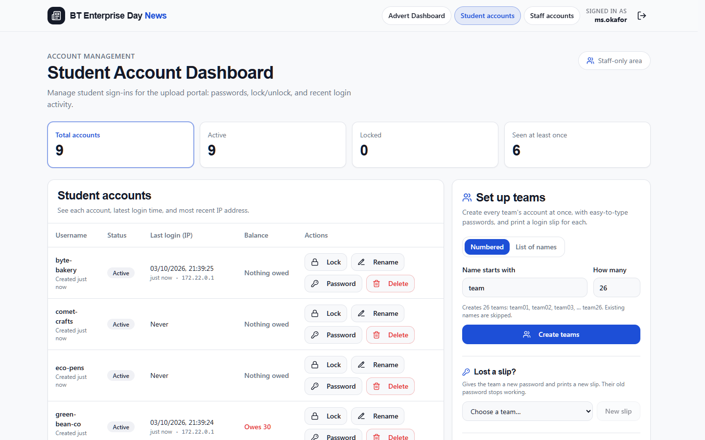

# BT Enterprise Day News App

A suite of three web applications designed for school students to upload news article images, staff to vet and manage them, and a projector to display approved images in a rotating slideshow.

> **IMPORTANT: Blank Screen / Branding Issues**: If you experience a blank screen after login or do not see the updated "BT" branding, it is likely due to stale browser cache or a stale Docker build. Please follow these steps:
> 1. **Rebuild Docker**: Run `docker-compose up --build --force-recreate` to ensure the latest frontend changes are compiled.
> 2. **Clear Browser Cache**: Use `Ctrl + F5` (or `Cmd + Shift + R`) to force a hard reload of the page.
> 3. **Incognito Mode**: Try accessing the site in an Incognito/Private window to rule out persistent cache issues.

## Project Overview

The system consists of three main components, each with a different audience:
1.  **Student App** (`/student`) — used by 13/14-year-old students, mostly on phones and tablets. A simple, mobile-friendly interface for each student company to upload images of its adverts/news articles. Nothing a student uploads is shown until an adult has approved it.
2.  **Staff App** (`/staff`) — used by adult staff to vet and check student uploads and to add their own content. It has three sections, switched from the top banner (Adverts / Students / Staff):
    -   **Advert Dashboard**: review, approve, or reject uploaded images (with a reason for the team), manage display order, add staff images and information messages, set up the projector, and see the **Results**: each team's spend and screen time, as a leaderboard and team receipts to print (till printer or A4).
    -   **Student Account Dashboard**: list the company/student accounts, add or delete accounts, lock/unlock them, reset passwords, and see when (and from which IP address) each account last signed in.
    -   **Staff Account Dashboard**: the same for staff logins, so staff can add colleagues, reset passwords, and lock or remove accounts (but not their own).
3.  **Projector App** (`/projector`) — runs unattended on a machine plugged into the event's screen projector. A full-screen rotation of approved student adverts (in staff order, with paid priority and duration) and staff content, with staff-configurable timing.

Students run companies with virtual event money: they **pay for priority** (how often their advert appears) and **duration** (how long it stays up). How that turns into screen time is described in [docs/design-notes.md](docs/design-notes.md).

### Screenshots

All teams, adverts and names below are made up.

**Student app** (on a phone): the upload page, choosing and paying for screen time, and the team's adverts with their review status.

| Upload | Prices | Your uploads |
|---|---|---|
|  |  |  |

**Staff app:** reviewing new uploads, the approved adverts in projector order, and managing team accounts.





**Projector:** the big screen playing an approved advert.


To regenerate them after UI changes, run `.\tools\screenshots\make-screenshots.ps1` (add `-Build` to use this checkout's code). It runs a separate demo copy of the apps with made-up data, so local and event data are never touched or shown.

### User Guides

-   [Student Guide](docs/student-guide.md): for students uploading adverts.
-   [Staff Guide](docs/staff-guide.md): the Advert Dashboard, Event Communications, Projector settings, End of Day and the Student Account Dashboard.
-   [Projector Guide](docs/projector-guide.md): setting up and running the big screen.
-   [Design notes](docs/design-notes.md): audiences, advert economics, projector scheduling, security and offline operation (for developers).

Keep these guides up to date whenever a change affects what users see or do.

## Event Setup

The event runs on a **private Wi-Fi network with no internet connection**. One machine (the *server*) runs all three apps in Docker; every other device just uses a web browser. Nothing in the apps needs the internet at run time: there are no external fonts or CDNs, and the image checker's model is bundled into the app.

### Equipment

| Item | Notes |
|---|---|
| **Server**: a laptop or mini-PC | Runs Docker (Linux recommended; Windows/Mac with Docker Desktop also works). At least 4 GB RAM and a few GB of free disk. Mains power, with sleep/hibernate turned **off**. |
| **Wi-Fi router / access point** | Creates the private network (WPA2/WPA3 password; no internet uplink needed). Enough capacity for every student company's device plus staff and the projector; 5 GHz preferred. DHCP on, with a **reserved (fixed) IP for the server**, e.g. `192.168.1.10`. |
| **Projector computer** | Any laptop with a browser (Chrome or Edge) and the right video cable (HDMI, etc.) for the projector. Screen saver and sleep turned off. |
| **Staff devices** | Laptops or tablets with a browser, on the event Wi-Fi. |
| **Student devices** | Phones or tablets (school or own), on the event Wi-Fi. |
| **Cables and power** | Network cables for the server (and ideally the projector computer) to the router, the projector video cable, extension leads. |
| **Signs** | Printed Wi-Fi name, Wi-Fi password and the app address (e.g. `http://192.168.1.10/student`), ideally as a QR code. |
| **Till printer** (optional) | An 80 mm receipt printer, e.g. Epson TM-T88, with its Windows driver on a staff laptop, for team login slips (each with QR codes to join the Wi-Fi and open the app). Or print them on A4. |

Plug the server, and ideally the projector computer, into the router with **cables**. That keeps the Wi-Fi free for phones and is more reliable.

**How big an event?** A normal event is 26 teams, a big one 52 (two students per team, each on a phone: up to 104 phones), plus 3 staff and the projector. Load tests show the server handles that with lots to spare: about 600 teams on a laptop before responses slow down (see [`loadtest/README.md`](loadtest/README.md)). The Wi-Fi is the real limit. One consumer access point copes well with around 30–50 busy phones, so for a big event use two or more access points on the same network.

### Before the event (server briefly online)

Do this a day or more ahead, on the server, while it **is** connected to the internet:

1. Get the latest project files: `git pull` (or copy the repo, including `docker-compose.yml`).
2. First time only: create a `.env` next to `docker-compose.yml` with `FRONTEND_PORT=80` (so the address has no port number) and the first staff login (`APP_STAFF_BOOTSTRAP_USERNAME`, `APP_STAFF_BOOTSTRAP_PASSWORD`). Nothing else is needed; see [Settings](#settings-env).
3. If the images on GitHub Container Registry are private, sign in: `docker login ghcr.io`.
4. Download the images: `docker compose pull db backend frontend`.
5. Start it once to check: `docker compose up -d db backend frontend`. Sign in as staff, check the **Projector** settings, and on the Student Account Dashboard use **Set up teams** to create the team accounts and print their login slips (on the till printer or A4; see the [Staff Guide](docs/staff-guide.md#setting-up-teams-and-printing-login-slips)).
6. Make sure the server's **clock is correct** before going offline. Sign-in sessions, image links and login times rely on it.

You don't need Caddy at the event. It provides HTTPS for the public hosted domain and can't get certificates without the internet, so it's left out.

### At the event (offline)

1. Connect the server to the event router and check it has its reserved IP.
2. Start the apps: `docker compose up -d db backend frontend`. Don't run `auto-deploy-docker.sh` or `docker compose pull`; they need the internet.
3. From a phone on the event Wi-Fi, open `http://<server-ip>/` and check the home page loads.
4. **Projector computer:** open `http://<server-ip>/projector` and press **F11** for full screen (see the [Projector Guide](docs/projector-guide.md)).
5. **Staff:** `http://<server-ip>/staff`. **Students:** `http://<server-ip>/student`.

Tips:

-   **Phones and "no internet":** phones may warn that the Wi-Fi has no internet, or quietly switch to mobile data. Ask students to choose **stay connected** / **use this network anyway**, or turn mobile data off while they use the app.
-   **"Not secure" in the address bar** is expected: the private network uses plain `http://`. Nobody should reuse a real password from another site.
-   **Recorded login IPs** on the Student Account Dashboard are the devices' addresses on the event Wi-Fi.
-   If the event network uses `172.16.x.x`–`172.31.x.x` addresses, see the note in `frontend/nginx.conf` (it clashes with Docker's own range).

### After the event

-   Use **End of Day → Clear Down** in the staff app to delete student uploads, or `docker compose down` to stop everything while keeping the data. `docker compose down -v` deletes **all** data, including accounts.
-   Back online, `git pull` and `docker compose pull` again before the next event.

## Tech Stack

### How the pieces fit together

```
Browser (student phone / staff laptop / projector PC)
   │  HTTPS
   ▼
Caddy  ── TLS certificates + reverse proxy (hosted deployment only)
   │
   ▼
Nginx (frontend container) ── serves the built React app
   │   /api/*  and  /uploads/*  are proxied to ▼
   ▼
Spring Boot (backend container) ── REST API, auth, image storage
   │                       │
   ▼                       ▼
PostgreSQL (db container)  "uploads" Docker volume (image files)
```

All three apps (`/student`, `/staff`, `/projector`) are routes in **one** React single-page app, backed by **one** Spring Boot API.

### Backend (`/src`)
| Technology | How it's used |
|---|---|
| **Java 25 + Spring Boot 3.4** | REST API under `/api/*` (auth, student uploads, staff moderation, projector feed). |
| **Spring Web** | Controllers in `controller/`; responses go through DTOs in `dto/` rather than exposing JPA entities directly. |
| **Spring Security + JJWT** | Stateless JWT auth. `POST /api/auth/login` issues a token carrying the user's role (`STUDENT` or `STAFF`); `JwtAuthenticationFilter` checks it on every request and `SecurityConfig` restricts each URL to a role. Student passwords are hashed with BCrypt. |
| **Spring Data JPA (Hibernate)** | Entities in `model/` (`ImageMetadata`, `StudentAccount`, settings) with repositories in `repository/`. |
| **PostgreSQL 16** | Main database in Docker. |
| **Flyway** | Versioned schema migrations in `src/main/resources/db/migration` (`V1__…`, `V2__…`). Hibernate only *validates* the schema; any schema change needs a new migration file. |
| **Lombok** | Generates boilerplate (getters/setters, builders, constructors) on entities and services. |
| **Local disk / Docker volume** | Uploaded images are written to `app.upload-dir` (the `uploads` volume, mounted only into the backend) and served from `/uploads/*`. Only items currently on the projector are public; everything else needs a signed link (see [Image access](#image-access)). |
| **JUnit 5, MockMvc, Mockito, H2, JaCoCo** | Backend tests run against an in-memory H2 database; JaCoCo produces the coverage report. |

### Frontend (`/frontend`)
| Technology | How it's used |
|---|---|
| **React 18 + TypeScript** | UI for all three apps; pages live in `src/pages`. |
| **Vite** | Dev server (`npm run dev`) and production build. The build is stamped with `APP_VERSION`, which is shown at the bottom of the main screen. |
| **React Router** | Routes `/student`, `/staff`, `/staff/students`, `/projector` and their login pages. |
| **Tailwind CSS + shadcn/ui (Radix UI) + lucide-react** | Styling, accessible UI components, and icons. |
| **TanStack Query** | Fetching and caching API data. `src/lib/api.ts` is the single API client and attaches the JWT. |
| **TensorFlow.js + NSFWJS** | In-browser image checker. Student uploads are scanned on the device *before* they are sent, as an extra safeguard on top of staff approval. |
| **sonner** | Toast notifications. |
| **Vitest + Testing Library + jsdom** | Frontend unit and component tests. |

### Infrastructure
| Technology | How it's used |
|---|---|
| **Docker + Docker Compose** | Runs `db`, `backend`, `frontend` (and `caddy` when hosted) as containers. Multi-stage Dockerfiles build the Java JAR and the React bundle. |
| **Nginx** | Inside the frontend container: serves the static React build and proxies `/api` and `/uploads` to the backend, adding the client IP to `X-Forwarded-For`. The backend only trusts that header from internal (Docker-network) proxies (`server.forward-headers-strategy=native`). |
| **Caddy** | Hosted deployment only: automatic HTTPS and reverse proxy in front of the frontend. Not used for local testing. |
| **GitHub Container Registry (ghcr.io)** | Stores built images (`news-backend`, `news-frontend`) pushed by `build-and-push.ps1` / `.sh`. |
| **GitHub Actions** | `.github/workflows/test-and-coverage.yml` runs the tests on each push. |

## Prerequisites

-   **Java 25** (if running locally)
-   **Maven 3.9+** (if building locally)
-   **Node.js & npm** (if developing frontend locally)
-   **Docker & Docker Compose** (recommended for running the full stack)

## Getting Started

### 1. Build the Project

You can build the backend and frontend separately or let Docker Compose handle it.

#### Backend (Maven)
```bash
mvn clean package
```
To run the backend outside Docker, point the datasource settings at a PostgreSQL database. A signing secret is generated automatically (see [Settings](#settings-env)).

#### Frontend (NPM / Vite)
```bash
cd frontend
npm install
npm run dev   # For development (Hot Reloading)
npm run build # For production build
```

### 2. Run with Docker Compose

#### Settings (`.env`)

Docker Compose reads optional settings from an untracked `.env` file next to `docker-compose.yml`. **This repository is public: never commit your `.env`.** Copy `.env.example` to start. Normally only the first staff login is needed:

| Setting | Needed? | What it does |
|---|---|---|
| `APP_STAFF_BOOTSTRAP_USERNAME` / `APP_STAFF_BOOTSTRAP_PASSWORD` | **First start only** | Creates the first staff account (see [Authentication](#authentication-jwt)). After that you can delete these lines. |
| `FRONTEND_PORT` | At the event | `80` so the address is just `http://<server-ip>/`. Defaults to `3000`. |
| `POSTGRES_PASSWORD` | No | Database password. Defaults to `password`. That's deliberate: the database port is only reachable from the server itself, and a once-a-year event shouldn't depend on remembering a password. |
| `APP_JWT_SECRET` | No | The key that signs logins. If unset, the backend **generates a random one on first start and keeps it in the database** (`app_secrets` table), so there's nothing to create or remember. If you do set one, it must be at least 32 characters and never a value that has appeared in this repo. |
| `FREEDNS_UPDATE_KEY` | Hosted deployment only | Used by `auto-deploy-docker.sh`. |
| `APP_CORS_ALLOWED_ORIGINS` | Rarely | See [Network exposure](#network-exposure). |

Changing or removing the signing secret signs everyone out; they just sign in again.
#### Starting the stack

The easiest way to run the entire stack is using Docker Compose:

```bash
export CR_PAT=your_github_pat_here  # Set this if you want to pull the latest frontend image from GitHub Packages
echo $CR_PAT | docker login ghcr.io -u YOUR_GITHUB_USERNAME --password-stdin
docker-compose up --build
```
```powershell
# Set your token as a variable in the current session
$env:CR_PAT = "YOUR_GITHUB_TOKEN_HERE"

# Pipe the token into docker login
$env:CR_PAT | docker login ghcr.io -u YOUR_GITHUB_USERNAME --password-stdin

# Build both the frontend and backend images
docker compose build

# Push them both to GitHub Container Registry
docker compose push
```

### 2.1 Versioned Local Build + Push (Recommended)

If you build from your laptop, use the helper scripts in the repo root. They:
- stamp `APP_VERSION` as `YYYY.MM.DD-HHMMSS-<git-sha>`
- run `docker compose build`
- tag backend/frontend images with both `latest` and the stamped version
- push only if build succeeds

```powershell
# Windows PowerShell
cd C:\code\EnterpriseDayNews
.\build-and-push.ps1
```

```bash
# macOS / Linux
cd /path/to/EnterpriseDayNews
./build-and-push.sh
```

Optional flags:

```powershell
.\build-and-push.ps1 -BuildOnly
.\build-and-push.ps1 -Version 2026.05.14-120000-ab12cd3
.\build-and-push.ps1 -DryRun
```

```bash
./build-and-push.sh --build-only
./build-and-push.sh --version 2026.05.14-120000-ab12cd3
./build-and-push.sh --dry-run
```

This will start:
-   **PostgreSQL**: Database for image metadata, student accounts and settings.
-   **Backend (Java)**: REST API at `http://localhost:8080`, reachable from this machine only. The PostgreSQL port (`5432`) is too. Everyone else goes through the frontend.
-   **Frontend (Nginx Prod)**: Accessible at `http://localhost:3000` (built bundle).
-   **Caddy**: HTTPS reverse proxy for the public hosted domain only (see below).

### 2.2 Local Testing with Docker

Testing is done locally with Docker Desktop. For a first start, put a staff login in `.env` (see [Settings](#settings-env)). The `caddy` service is configured for the public hosted domain and needs ports 80/443, so leave it out locally:

```bash
docker compose up --build db backend frontend
```

-   Always pass `--build`, otherwise Compose may pull the published `:latest` images from GitHub Container Registry instead of testing your local changes.
-   The database lives in the `db` container; `docker compose down -v` wipes it (and uploaded images) for a clean start.

### 3. Accessing the Apps

-   **Student View**: `http://localhost:3000/student`
-   **Staff View**: `http://localhost:3000/staff`
-   **Projector View**: `http://localhost:3000/projector`

When running the Vite dev server (`npm run dev`) instead, use `http://localhost:5173` with the same paths.

## Authentication (JWT)

The system uses JWT (JSON Web Token) authentication.
1.  **Login**: Users must first authenticate via `POST /api/auth/login` to receive a token.
    -   Body: `{"username": "...", "password": "...", "role": "STUDENT|STAFF"}`
2.  **Bearer Token**: All protected API requests must include the `Authorization: Bearer <token>` header.

**Student accounts** are stored in the database and managed by staff from the Student Account Dashboard:
-   Usernames are case-insensitive and may contain letters, numbers, dots, dashes and underscores.
-   Passwords are stored as bcrypt hashes and must be at least 6 characters with an uppercase letter and a number; common passwords are rejected.
-   Five failed sign-ins temporarily lock an account for 15 minutes. Staff can also lock an account indefinitely; unlocking clears any temporary lock.
-   The time and IP address of each successful sign-in are recorded.

**Staff accounts** are stored in the database too (BCrypt-hashed, same 5-attempt / 15-minute lockout). Staff passwords must be at least 10 characters with a capital letter and a number.
-   **First staff account:** set `APP_STAFF_BOOTSTRAP_USERNAME` and `APP_STAFF_BOOTSTRAP_PASSWORD` in `.env` and start the stack. The account is created **only if there are no staff accounts yet**, and is never reset from `.env` afterwards, so you can delete the password line once you've signed in. If no staff account exists and these are not set, the backend logs a warning and nobody can sign in to `/staff`.
-   Further staff accounts are added and managed from the **Staff Account Dashboard** (`/staff/staff-accounts`). You can't lock or delete your own account, so there is always at least one working staff login.
-   **Locking or deleting an account takes effect immediately** for students and staff: an existing sign-in stops working at once rather than when it expires.

**No built-in accounts.** Older versions created `student` and `guest` student accounts with passwords published in this repository. They are no longer created. On startup, any existing account still using one of those passwords is **locked automatically** (logged as a warning). To reuse it, set a new password and unlock it from the Student Account Dashboard.

The frontend automatically handles login and token management when navigating to `/student` or `/staff`.

## Project Structure

-   `/src`: Spring Boot backend source code.
-   `/frontend`: React + Vite + Tailwind source code.
-   `docker-compose.yml`: Orchestration for the database, backend, and frontend.
-   `Dockerfile`: Docker configuration for the Java backend.
-   `frontend/Dockerfile`: Multi-stage Docker configuration for the frontend (Dev & Prod).

## API Endpoints

-   `POST /api/auth/login`: Authenticate and receive a JWT token.
-   `POST /api/student/upload`: Upload an image (role: STUDENT). Form fields: `file`, `priority` (1-4), `durationSeconds` (10, 20 or 30), `publishOnApproval` (default `true`; `false` = wait after approval until the student publishes). Anything not on the price list is refused (`400`).
-   `GET  /api/student/prices`: The price list (priority and duration choices and their costs) as it is now, including any price wobble (`wobble`: percent, message, until when). The student page builds its choices and total from this; the only copy is `PriceList.java`.
-   `GET|PUT|DELETE /api/staff/price-wobble`: The price wobble (staff): get it (`204` at normal prices), set it (`{"percent": 50, "message": "...", "startsAt": null, "endsAt": "..."}`, 25–300%), or end it now.
-   `GET  /api/staff/prices?percent=150`: The price list at a percentage of normal, to preview a wobble.
-   `GET  /api/student/uploads`: List current user's uploads.
-   `DELETE /api/student/uploads/{id}`: Delete one of the current user's own uploads.
-   `POST /api/student/uploads/{id}/publish?published=true|false`: For your own approved advert, put it on screen or take it off; while it's awaiting review, choose whether it goes on screen when approved. Refused (`409`) for rejected adverts.
-   `GET  /api/staff/new`: List images awaiting review (role: STAFF).
-   `GET  /api/staff/approved`: List approved images.
-   `GET  /api/staff/rejected`: List rejected images.
-   `POST /api/staff/approve/{id}`: Approve an image (auto-displayed).
-   `POST /api/staff/reject/{id}`: Reject an image (auto-hidden). Optional JSON body `{"reason": "..."}` (up to 200 characters), shown to the student as a "Teacher's note" and returned as `rejectionReason`; approving clears it.
-   `POST /api/staff/toggle-display/{id}?display=true|false`: Show/hide an approved image.
-   `POST /api/staff/order`: Reorder approved images (JSON body: `[id1, id2, ...]`).
-   `GET  /api/staff/info`: List information messages.
-   `POST /api/staff/info/upload?flash=true|false`: Staff upload of an information message (image).
-   `POST /api/staff/info/free-text?flash=true|false`: Post a free-text urgent message.
-   `POST /api/staff/toggle-flash/{id}?flash=true|false`: Toggle FLASH mode for an image/message.
-   `DELETE /api/staff/{id}`: Delete an image.
-   `POST /api/staff/reset-event`: Reset the event: delete all student adverts and restore the default projector settings (keeps staff library items and accounts). Returns `{"deletedAdverts": n}`.
-   `GET  /api/staff/students`: List student accounts (incl. lock state, last login time and IP).
-   `POST /api/staff/students`: Create a student account (JSON body: `{"username": "...", "password": "..."}`).
-   `POST /api/staff/students/{id}/lock?locked=true|false`: Lock or unlock a student account.
-   `PUT  /api/staff/students/{id}/password`: Reset a student's password (JSON body: `{"password": "..."}`).
-   `DELETE /api/staff/students/{id}`: Delete a student account.
-   `PUT  /api/staff/students/{id}/username`: Rename a student account (JSON body: `{"username": "..."}`). `409` if the name is used by any other student account (active or locked); their uploads move to the new name.
-   `POST /api/staff/students/teams`: Create many team accounts at once with generated passwords (JSON body: `{"usernames": ["team01", ...]}`, up to 200). Returns each team's username and new password once (`CREATED`), or `SKIPPED` with the reason (e.g. already exists).
-   `POST /api/staff/students/{id}/generated-password`: Give one team a new generated password (to reprint a lost login slip).
-   `GET|PUT /api/staff/event-details`: The Wi-Fi name, Wi-Fi password and app address printed on login slips.
-   `/api/staff/staff-accounts`: the same operations (`GET`, `POST`, `POST /{id}/lock`, `PUT /{id}/password`, `PUT /{id}/username`, `DELETE /{id}`) for staff accounts. Locking or deleting your own account is refused with `409`.
-   Requests without a valid sign-in (missing, expired, or for an account that has since been locked, renamed or deleted) get `401`, and the frontend returns to the sign-in page. Signed in with the wrong role gets `403`.
-   `GET  /api/projector/images`: Items the projector may show: FLASH items if any, otherwise approved + displayed items (student adverts and staff content) in staff order. The projector page decides what to show next; see [docs/design-notes.md](docs/design-notes.md#projector-scheduling). Public.
-   `GET  /api/projector/settings`: Current display settings. Public.
-   `POST /api/projector/plays`: The projector reporting what it showed (role: PROJECTOR, i.e. the projector key). JSON body: `[{"imageId": 1, "seconds": 20, "playedAt": "..."}]`. Implausible entries are skipped; returns `{"recorded": n}`.
-   `POST /api/staff/projector-key`: A projector key (7 days, valid while the issuing staff account is active). The staff app's **Open the projector** uses it.
-   `GET  /api/staff/results`: Every team's spend, plays, screen time and cost per minute, most screen time first, plus when the projector last recorded a showing.
-   `GET  /api/student/results`: The signed-in team's totals and each advert's screen time.
-   `POST /api/projector/settings`: Update display settings (role: STAFF). JSON body: `intervalSpeedSeconds` (staff content interval, 0-3600), `displayDurationSeconds` (staff item display time, 3-120), `imageRefreshSeconds` (projector refresh, 2-60).
-   `GET  /uploads/{file}`: An image file. Public only for items on the projector; otherwise use the signed `imageUrl` from the API.

**Errors:** when the API refuses a request on purpose (validation, conflicts, lockouts), the response body is a plain-text message written for users, e.g. `Student account is locked`. The frontend shows it as-is, and otherwise falls back to a plain-English message based on the status code, so users never see raw status codes or HTML error pages.

**Upload limits:** 10 MB per file (`spring.servlet.multipart.max-file-size`, nginx `client_max_body_size`, and `FILE_SIZE_LIMITS.maxMb` in the frontend must all match); JPEG, PNG, GIF or WebP only.

Every image in API responses includes an `imageUrl` field. Always load images from it rather than building a URL from `filePath`.

### Image access

-   **Public:** items the projector shows (approved and set to display, or in FLASH).
-   **Everything else** (awaiting review, hidden, rejected) is only served through a **signed link**. The API includes it in `imageUrl` for staff, and for the student who uploaded the item. Links are signed with a key derived from `APP_JWT_SECRET` and stay the same for an hour (so polling dashboards don't re-download images), then expire after 1–2 hours.
-   Requests without a valid link, and files with no database record, get a 404.

### Network exposure

-   The backend (`8080`) and database (`5432`) ports are bound to `127.0.0.1`. The frontend (`3000`) is published on all interfaces so phones on the same network can test it. In the hosted deployment, Caddy (`80`/`443`) is the public entry point.
-   **Client IPs** (shown on the Student Account Dashboard) are worked out by the frontend's nginx, the first hop: it only believes a visitor's `X-Forwarded-For` when the request comes from a Docker-network address (Caddy, in the hosted setup), then passes just the resolved IP to the backend. On the event's private Wi-Fi, phones connect straight to nginx, so a faked header is ignored and their real `192.168.x`/`10.x` address is recorded. If the event network itself uses `172.16.0.0/12` addresses, narrow `set_real_ip_from` in `frontend/nginx.conf` to the Docker subnet. The backend additionally only accepts forwarded headers from internal proxies (`server.forward-headers-strategy=native`). When testing with Docker Desktop, your browser appears to come from a Docker address, so locally recorded IPs can be faked; that doesn't apply on a Linux server.
-   **CORS:** off by default, because the frontend and API share an origin. If you host the frontend elsewhere (`VITE_API_BASE_URL`), set `APP_CORS_ALLOWED_ORIGINS` to a comma-separated list of allowed origins.

### Configuration

-   `app.jwt.secret` (env: `APP_JWT_SECRET`): secret key for signing JWTs. Optional: generated and stored in the database if unset. Tests use their own test-only value in `src/test/resources/application.properties`.
-   `spring.datasource.password` (env: `SPRING_DATASOURCE_PASSWORD`): set from `POSTGRES_PASSWORD` in `.env` when run with Docker Compose.
-   `app.jwt.expiration-ms` — Token expiration time (default: 1 hour).
-   `app.upload-dir` (env: `APP_UPLOAD_DIR`) — directory where uploaded images are stored. Defaults to `./uploads`.

## Running Tests

### Backend (JUnit + JaCoCo)
```bash
mvn clean test
```
Coverage report: `target/site/jacoco/index.html` (currently >90% instruction coverage).

### Frontend (Vitest)
```bash
cd frontend
npm install
npm test
```
This runs Vitest for the new frontend structure. For watch mode use `npm run test:watch`.

For coverage, run `npm run test:coverage`. It prints a summary and writes an HTML report to `frontend/coverage/index.html`. Generated shadcn/ui components (`src/components/ui`) are excluded.

Tests cover:
- `api.test.ts`: API client logic, header handling, signed image URLs and user-facing error messages.
- `fileSizeCheck.test.ts`: upload size limits (kept equal to the server's 10 MB) and allowed file types.
- `useNsfwCheck.test.ts`: the in-browser image scanner.
- `StudentLogin.test.tsx`, `StudentUpload.test.tsx`: the student sign-in and upload pages.
- `StaffLogin.test.tsx`, `BrandNav.test.tsx`: staff sign-in and the top banner.

`axios` or `fetch` is mocked in every test, so no backend is required.

### Load testing (k6)

`loadtest/` simulates a whole event (52 teams' phones, 3 staff and the projector) against the local Docker stack, including an "everyone at once" burst. `loadtest/find-limit.ps1` keeps adding teams until responses get too slow. Instructions and the latest results are in [`loadtest/README.md`](loadtest/README.md). Run it locally only: it creates test accounts and adverts.

## License

This project is developed for Enterprise Day.
